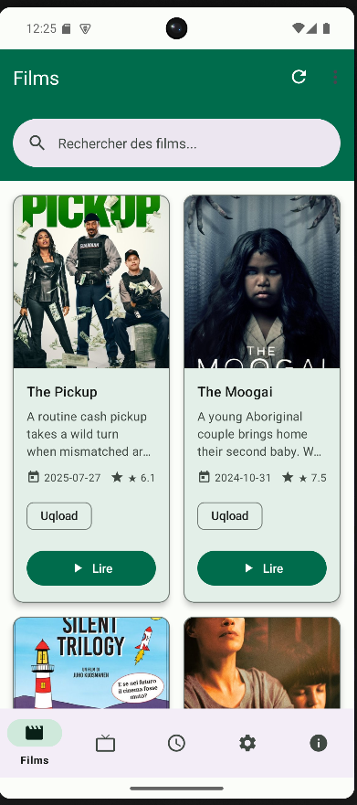

# Stream4Life - Canevas du Projet



## 1. Proposition de valeur
**Stream4Life** est une application Android intuitive qui simplifie la gestion de vos films et séries préférés, offrant une expérience personnalisée et moderne pour les amateurs de médias.

- **Objectif** : Faciliter le suivi des listes de visionnage avec une interface fluide et des fonctionnalités personnalisables.
- **Pour qui** : Cinéphiles, spectateurs occasionnels, utilisateurs Android.
- **Avantages** : Gestion simplifiée, notifications personnalisées, design moderne.

## 2. Problème résolu
- Difficulté à organiser et suivre les films/séries à regarder.
- Manque d’options personnalisables dans les applications similaires.
- Besoin d’une interface réactive et intuitive pour gérer les statuts vus/non vus.

## 3. Solution proposée
**Stream4Life** permet de :
- Gérer une **liste de visionnage** (ajout, suppression, organisation).
- Suivre les **statuts vus/non vus** en temps réel.
- Recevoir des **notifications** pour les nouvelles sorties.
- Personnaliser l’expérience (mode sombre, langues : français, anglais, espagnol).
- Offrir une **interface utilisateur** basée sur Material Design.

## 4. Public cible
- **Utilisateurs** : Amateurs de films/séries, adolescents et jeunes adultes (15-30 ans).
- **Contexte** : Utilisation personnelle pour organiser et suivre des contenus multimédias.
- **Plateforme** : Utilisateurs Android (API 21+).

## 5. Fonctionnalités principales
| Fonctionnalité                | Description                                                                 |
|-------------------------------|-----------------------------------------------------------------------------|
| **Gestion de la liste**       | Ajoutez, supprimez et organisez vos films/séries préférés.                  |
| **Suivi du statut**           | Marquez les contenus comme vus ou non vus avec mise à jour en temps réel.  |
| **Notifications**             | Activez/désactivez les alertes pour les sorties ou mises à jour.            |
| **Personnalisation**          | Mode sombre, choix de langue (français, anglais, espagnol), ajustement du scraping. |
| **Interface utilisateur**     | Design épuré et intuitif basé sur Material Design.                          |

## 6. Pile technologique
- **Langages** : Kotlin, Java
- **Frontend** : XML Android, Material Design Components
- **Backend** : Room Database (stockage local)
- **Bibliothèques** :
  - Glide (chargement d’images)
  - Coroutines et Flow (opérations asynchrones)
  - View Binding (gestion d’interface)
  - RecyclerView (affichage dynamique)
- **Outils** : Android Studio, Git

## 7. Installation
1. **Cloner le dépôt** :
   ```bash
   git clone https://github.com/pecorio-dev/stream4life.git
   ```
2. **Ouvrir dans Android Studio** :
   - Importez le projet.
   - Configurez le SDK Android et Gradle.
3. **Compiler et exécuter** :
   - Synchronisez avec Gradle.
   - Lancez sur un émulateur ou appareil physique (API 21+).

## 8. Utilisation
- **Ajouter des titres** : Sections Films/Séries pour enrichir votre liste.
- **Gérer la liste** : Marquez les titres comme vus, activez les notifications, supprimez des éléments.
- **Personnaliser** : Ajustez le mode sombre, la langue ou la puissance de scraping dans les Paramètres.
- **Rester informé** : Activez les notifications pour les nouvelles sorties.

## 9. À propos du développeur
**pecorio**, 17 ans. Autodidacte passionné, j’ai appris **HTML**, **CSS**, **JavaScript**, **Python**, **PHP**, **Kotlin** et **Java** via des tutoriels et projets personnels. **Stream4Life** est un projet solo qui reflète mon amour pour les films, les séries et la technologie.

## 10. Contribution
Les retours et contributions sont bienvenus :
1. Forkez le dépôt.
2. Créez une branche (`git checkout -b feature/votre-fonctionnalité`).
3. Validez vos modifications (`git commit -m "Ajout de votre fonctionnalité"`).
4. Poussez votre branche (`git push origin feature/votre-fonctionnalité`).
5. Ouvrez une Pull Request avec une description claire.

## 11. Projets futurs
- Support pour plus de langues.
- Synchronisation cloud des listes.
- Intégration de l’API TMDB pour la recherche.
- Amélioration de l’accessibilité.

## 12. Remerciements
- À la **communauté open-source** pour les ressources éducatives.
- Au **Lycée Parc de Vilgénis** pour son environnement stimulant.
- À **vous** pour découvrir **Stream4Life** !

## 13. Contact
- **GitHub** : [pecorio-dev](https://github.com/pecorio-dev)
- **Email** : [Ystream2free.pecorio@gmail.com]

Essayez **Stream4Life** et partagez votre expérience ! ⭐
